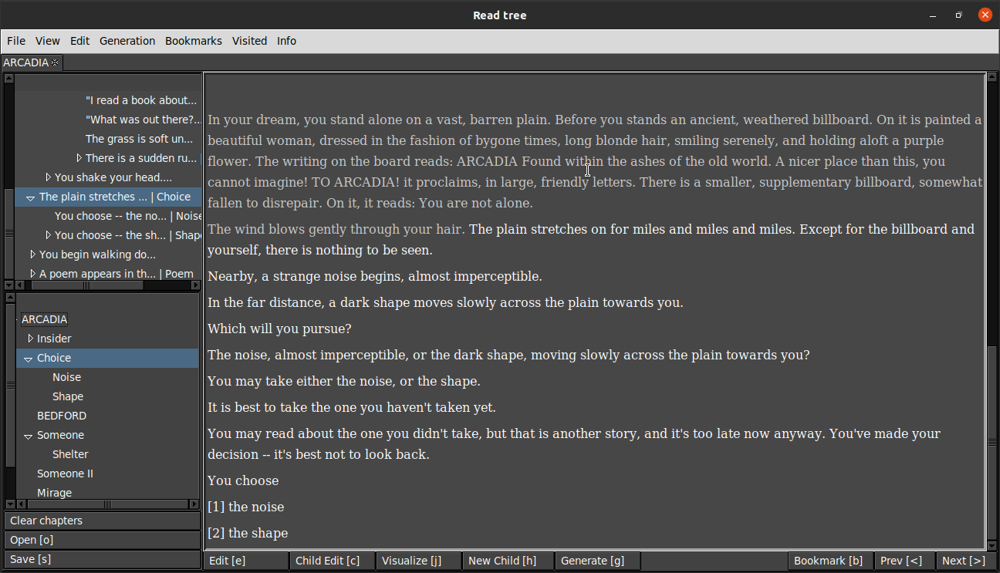
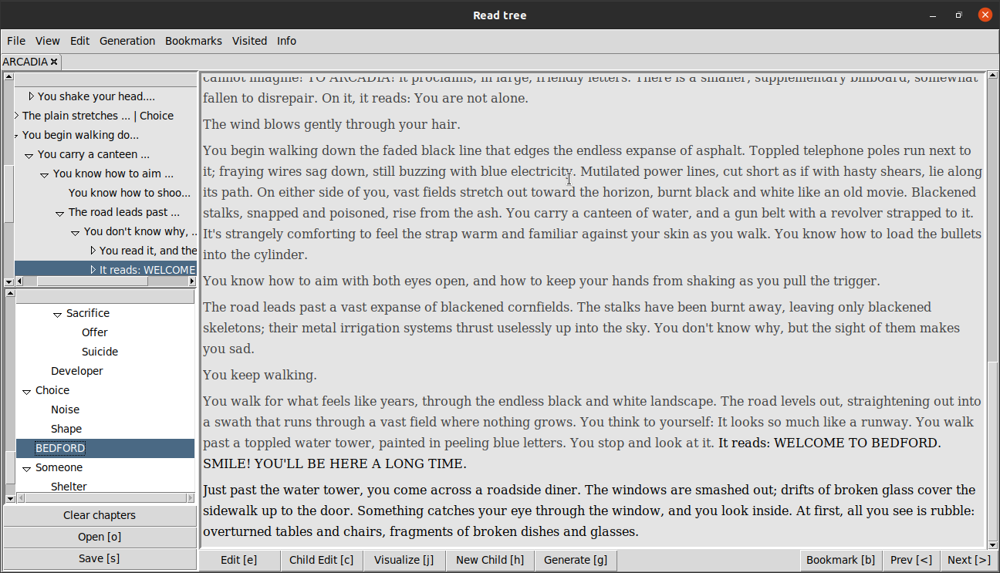
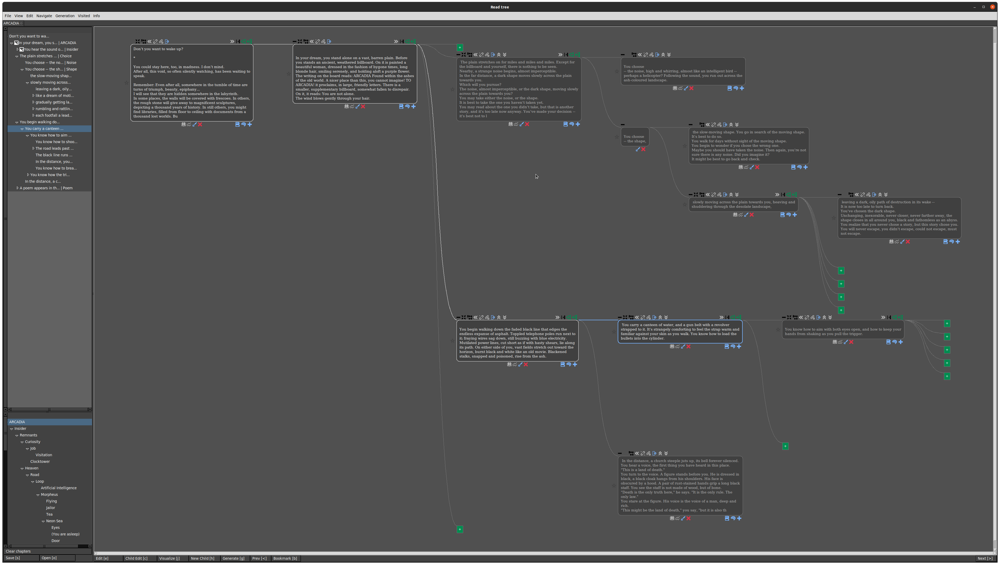
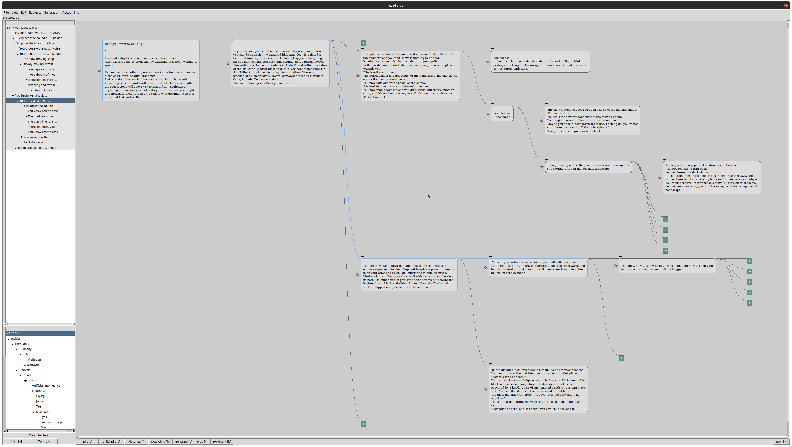
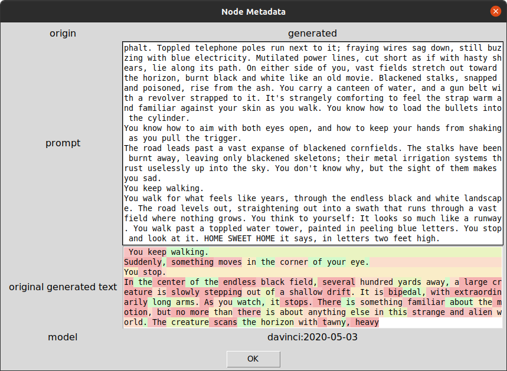
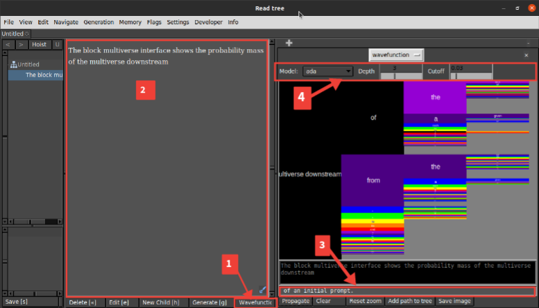

# Digital Loom

**Digital Loom** is an innovative, experimental tree-based writing interface designed to empower creators with non-linear storytelling capabilities. Powered by advanced AI models like OpenAI's GPT-3, Meta AI's Llama 3, and Google DeepMind Veo 3, it offers a dynamic platform for crafting, exploring, and visualizing narratives. This project is under active development, so expect evolving features and documentation as we refine the experience.

Follow our Social Experiment, weaved by Digital Loom: [@DigitalL0OM](https://x.com/DigitalL0OM)

> **Note**: As an experimental project, the codebase is unstable and documentation is a work in progress. We welcome feedback and contributions!

## Features

Digital Loom provides a robust set of tools for writers, developers, and creators:

- **Read Mode**:
  - Linear story view for seamless reading.
  - Tree navigation bar to explore story branches.
  - In-place edit mode for real-time content updates.

- **Tree View**:
  - Visually explore narrative trees with mouse interactions.
  - Expand or collapse nodes to focus on specific branches.
  - Modify tree topology to reorganize story structure.
  - Edit nodes directly within the tree interface.

- **Navigation**:
  - Intuitive hotkeys for efficient movement through the tree.
  - Bookmark nodes for quick access.
  - Organize content with chapters and track visited states.

- **Generation**:
  - Generate multiple child nodes using GPT-3, Llama 3, or Google DeepMind Veo 3.
  - Customize generation settings for tailored outputs.
  - Adjust hidden memory on a per-node basis for context-aware generation.
  - Veo 3 integration enhances narrative depth with advanced text and multimedia generation capabilities.

- **File I/O**:
  - Save and load narrative trees as JSON files.
  - Work with multiple trees across browser tabs.
  - Combine trees to merge storylines or ideas.

## Demo

Explore Digital Loom’s interface through these screenshots:







Discover the power of non-linear storytelling with Digital Loom!

## Block Multiverse Mode

Block Multiverse Mode offers a unique interface for exploring narrative possibilities. Learn more and watch a demo video [here](https://generative.ink/meta/block-multiverse/).

### How to Use Block Multiverse in Digital Loom

1. Click the `Wavefunction` button in the bottom bar to open the Block Multiverse interface in the right sidebar (resize by dragging).
2. Enter your initial prompt in the main textbox.
3. [Optional] Provide a ground truth continuation in the gray entry box at the bottom. Blocks in the ground truth trajectory will appear in black.
4. Configure the model (e.g., GPT-3, Llama 3, or Veo 3) and [generation parameters](https://generative.ink/meta/block-multiverse/#generation-parameters) in the top bar.
5. Click `Propagate` to generate and visualize the Block Multiverse.
6. Click any block to zoom ("[renormalize](https://generative.ink/meta/block-multiverse/#renormalization)") to that block’s perspective.
7. Click `Propagate` again to plot future multiverse branches from the renormalized frame.
8. Click `Reset zoom` to return to the initial view.
9. Click `Clear` to reset the multiverse plot before generating a new one.



## Hotkeys

*Note: Alt hotkeys correspond to Command on Mac.*

### File
- Open: `o`, `Ctrl-o`
- Import JSON as subtree: `Ctrl-Shift-O`
- Save: `s`, `Ctrl-s`

### Dialogs
- Change chapter: `Ctrl-y`
- Preferences: `Ctrl-p`
- Generation Settings: `Ctrl-Shift-P`
- Visualization Settings: `Ctrl-u`
- Multimedia dialog: `u`
- Tree Info: `Ctrl-i`
- Node Metadata: `Ctrl-Shift-N`
- Run Code: `Ctrl-Shift-B`

### Mode / Display
- Toggle edit/save edits: `e`, `Ctrl-e`
- Toggle story textbox editable: `Ctrl-Shift-e`
- Toggle visualize: `j`, `Ctrl-j`
- Toggle bottom pane: `Tab`
- Toggle side pane: `Alt-p`
- Toggle show children: `Alt-c`
- Hoist: `Alt-h`
- Unhoist: `Alt-Shift-h`

### Navigate
- Click to go to node: `Ctrl-Shift-click`
- Next: `period`, `Return`, `Ctrl-period`
- Prev: `comma`, `Ctrl-comma`
- Go to child: `Right`, `Ctrl-Right`
- Go to next sibling: `Down`, `Ctrl-Down`
- Go to parent: `Left`, `Ctrl-Left`
- Go to previous sibling: `Up`, `Ctrl-Up`
- Return to root: `r`, `Ctrl-r`
- Walk: `w`, `Ctrl-w`
- Go to checkpoint: `t`
- Save checkpoint: `Ctrl-t`
- Go to next bookmark: `d`, `Ctrl-d`
- Go to prev bookmark: `a`, `Ctrl-a`
- Search ancestry: `Ctrl-f`
- Search tree: `Ctrl-Shift-f`
- Click to split node: `Ctrl-Alt-click`
- Go to node by ID: `Ctrl-Shift-g`

### Organization
- Toggle bookmark: `b`, `Ctrl-b`
- Toggle archive node: `!`

### Generation and Memory
- Generate: `g`, `Ctrl-g`
- Inline generate: `Alt-i`
- Add memory: `Ctrl-m`
- View current AI memory: `Ctrl-Shift-m`
- View node memory: `Alt-m`

### Edit Topology
- Delete: `Backspace`, `Ctrl-Backspace`
- Merge with parent: `Shift-Left`
- Merge with children: `Shift-Right`
- Move node up: `Shift-Up`
- Move node down: `Shift-Down`
- Change parent: `Shift-P`
- New root child: `Ctrl-Shift-h`
- New child: `h`, `Ctrl-h`, `Alt-Right`
- New parent: `Alt-Left`
- New sibling: `Alt-Down`

### Edit Text
- Toggle edit/save edits: `Ctrl-e`
- Save edits as new sibling: `Alt-e`
- Click to edit history: `Ctrl-click`
- Click to select token: `Alt-click`
- Next counterfactual token: `Alt-period`
- Previous counterfactual token: `Alt-comma`
- Apply counterfactual changes: `Alt-Return`
- Enter text: `Ctrl-bar`
- Escape textbox: `Escape`
- Prepend newline: `n`, `Ctrl-n`
- Prepend space: `Ctrl-Space`

### Collapse / Expand
- Collapse all except subtree: `Ctrl-colon`
- Collapse node: `Ctrl-question`
- Collapse subtree: `Ctrl-minus`
- Expand children: `Ctrl-quotedbl`
- Expand subtree: `Ctrl-plus`

### View
- Center view: `l`, `Ctrl-l`
- Reset zoom: `Ctrl-0`

## Installation and Setup

### Windows
1. Install Python (>= 3.9.13) and Conda.
2. Create and activate a Conda environment:
   ```cmd
   conda create -n pyloom python=3.10
   conda activate pyloom

# Digital Loom Setup Guide

---

## Python Virtual Environment (Linux/macOS)

**Requires:** Python 3.9.13

### 1. Create and activate environment

```bash
python3 -m venv env
source env/bin/activate
```

### 2. Install dependencies

```bash
pip install -r requirements.txt
```

### 3. [Optional] Set environment variables

```bash
export OPENAI_API_KEY="your_openai_key"
export GOOSEAI_API_KEY="your_gooseai_key"
export AI21_API_KEY="your_ai21_key"
export VEO3_API_KEY="your_veo3_key"
```

### 4. Run the application

```bash
python main.py
```

> Load a JSON tree and start exploring!

---

## macOS (Conda Environment)

### 1. Create and activate Conda environment

```bash
conda create -n pyloom python=3.10
conda activate pyloom
```

### 2. Install dependencies

```bash
pip install -r requirements-mac.txt
```

### 3. Set environment variables

```bash
export OPENAI_API_KEY="your_openai_key"
export VEO3_API_KEY="your_veo3_key"
```

### 4. Run the application

```bash
python main.py
```

> Load a JSON tree and begin creating!

---

## Docker (Linux Only)

### [Optional] Set API keys in `Makefile` or configure via settings

### Build and run the container

```bash
make build
make run
```

> Load a JSON tree and explore.

---

## Local Inference with `llama-cpp-python`

Run models locally using [llama.cpp](https://github.com/ggerganov/llama.cpp), ideal for Mac users.

---

### Setup

#### 1. Create Conda environment

```bash
conda create -n llama-cpp-local python=3.10
conda activate llama-cpp-local
```

#### 2. Configure Metal backend (macOS M1/M2)

```bash
export CMAKE_ARGS="-DLLAMA_METAL=on"
```

#### 3. Install dependencies

```bash
pip install 'llama-cpp-python[server]'
pip install huggingface-hub
```

#### 4. Run the server with Hugging Face model

```bash
python3 -m llama_cpp.server \
  --hf_model_repo_id NousResearch/Meta-Llama-3-8B-GGUF \
  --model 'Meta-Llama-3-8B-Q4_5_M.gguf' \
  --port 8009
```

---

## Inference Setup

In a new terminal:

```bash
conda activate pyloom
python main.py
```

Then configure your local model in:

```
Settings > Model config > Add model
```

### Example config for `llama-cpp` on port 8009:

```json
{
  "model": "Meta-Llama-3-8B-Q4_5_M",
  "type": "llama-cpp",
  "api_base": "http://localhost:8009/v1"
}
```

---

## Contributing

We're excited to build **Digital Loom** with the community!

> Happy weaving with Digital Loom!

